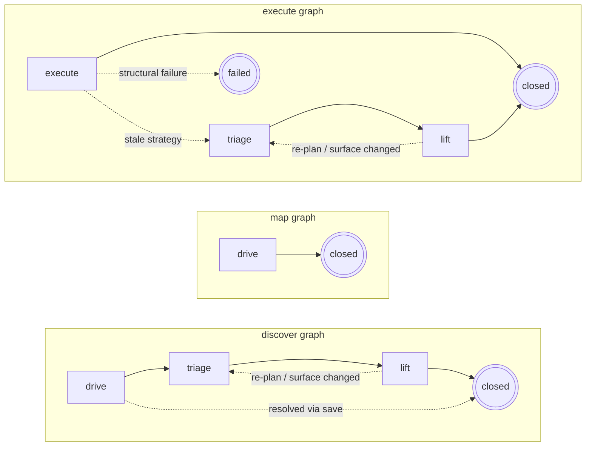

# Klura — Architecture

Klura turns a one-shot user request ("message adam on facebook") into a saved, reusable, fast skill. Each call goes through two phases:

1. **Discovery** — figure out how to do the thing on this site, save what you learn.
2. **Execution** — replay the saved strategy on every subsequent call.

This document opens with what happens in a single run, then summarizes the secondary capabilities that wrap that core loop, then points at the deep reference docs under `docs/` for everything else.

## The session FSM — three named graphs

Every session walks one of three declarative state machines. The `graph` parameter on `start_session` selects which:

| Graph | Topology | Use it for |
| --- | --- | --- |
| `discover` (default) | `drive → triage → lift → terminal{closed}` | Goal-directed reverse engineering. The standard reverse-engineering flow that dominates this doc. |
| `map` | `drive → terminal{closed}` | Surface mapping. Mutating actions gate behind a per-(action, selector) consent checkpoint; auto-synth is skipped at close; the re-persistence gate fires at lower thresholds. The platform logbook accretes the surface map for future sessions. |
| `execute` | `execute → triage → lift → terminal{closed \| failed}` | Run a saved strategy as the whole session. On stale-strategy failure, the FSM auto-falls into triage with the failure as defense-surface input — the agent re-plans and re-lifts. Arg / auth / structural failures terminate `failed`. |



Solid arrows are the primary path; dotted arrows are alternate transitions (early resolve, stale-strategy fall-through to triage, structural failure, re-plan back to triage when the user said no or `perform_action` crossed surfaces). Triage and lift do not branch on a "user approves" event — there's no `plan_rejected` in the FSM. The agent submits a plan via `submit_triage_plan`, the runtime fires an `ack_checkpoint`, and the agent reads `user_response` itself: re-submitting re-enters triage, RE moves transition to lift. Self-loops (`triage → triage` on `plan_submitted` / `surface_changed`) are omitted from the diagram for legibility — see [docs/session-phases.md](docs/session-phases.md) for the full edge list.

Graphs are data, not code: `runtime/src/session-phase/graphs/<name>.ts` exports each Graph literal (nodes, transitions, per-graph config). The dispatcher in `runtime/src/session-phase/state-machine.ts` is the only writer of `session.phase` and `session.status` — illegal transitions throw. Per-graph behavior (consent gates, auto-synth, re-persistence threshold) is declared in each Graph's `GraphConfig`, not as scattered `if` branches in the runtime. New graphs land as one new file under `graphs/`. Mermaid render via `runtime/src/session-phase/dump.ts`.

Full FSM mechanics — admissibility, round budgets, transition events, the failure-gate guard — in [docs/session-phases.md](docs/session-phases.md).

---

## A run, end to end

```
                ┌────────────────────────────────┐
                │  start_session(url, platform,  │
                │  capability, args, graph,      │
                │  lift_mode)                    │
                └───────────────┬────────────────┘
                                │
                ┌───────────────▼─────────────────┐
                │ Load policy.json                │
                │  └─ if recorded-path cap →      │
                │     prior_decline (ToS lock)    │
                │ Load saved strategies           │
                └───────────────┬─────────────────┘
                                │
                  ┌─────────────┴──────────────┐
                  │                            │
              has saved                   no saved
              strategy                    strategy
                  │                            │
                  ▼                            ▼
        ┌──────────────────┐        ┌──────────────────────┐
        │ AUTO-EXECUTE     │        │ Return a11y + URL +  │
        │ ✓ if served      │        │  task_contract       │
        │   tier < fetch   │        │  (graph-aware)       │
        │   AND logbook    │        └──────────┬───────────┘
        │   has prior      │                   │
        │   lift_attempts  │                   │
        │   → revisit_     │                   ▼
        │   prompt         │      ┌──────────────────────────┐
        └────────┬─────────┘      │ DRIVE                    │
                 │                │  agent clicks, reads,    │
        user says│                │  inspects network/JS;    │
        yes      │ user says      │  captures accumulate on  │
        ─────────┴── no           │  the Session             │
        │             │           └──────────┬───────────────┘
        │             │                      │
        ▼             ▼                      ▼
   re-enter      close_     ┌────────────────────────────────┐
   LIFT    ────► session    │ end_drive                  │
                            │  1. synth recorded-path if no  │
                            │     save and action history    │
                            │     is rich                    │
                            │  2. flush captures, actions,   │
                            │     tool trace, bundles, and   │
                            │     storage-state to workdir/  │
                            │     <platform>/sessions/<sid>/ │
                            │  3. recompute derived signals  │
                            │     (field-stability, bundle-  │
                            │     history, signer-history,   │
                            │     known-modules)             │
                            │  4. compute unresolved caps    │
                            │     (no save AND no user cap)  │
                            └──────────┬─────────────────────┘
                                       │
                            ┌──────────┴───────────┐
                            │ unresolved? ─ no ─► close cleanly
                            │           ─ yes ─►   │
                            │                      │
                  ┌─────────┼──────┬──────────────┐│
                  │         │      │              ││
              explicit_   auto    skip            ││
              learn       │       │               ││
              (default)   │       │               ││
                  │       │       │               ││
                  ▼       ▼       ▼               ▼
            handoff:  handoff: close       (no handoff)
            "TRIAGE   "PLOW      cleanly
            + ASK":   THROUGH":
            agent    agent
            composes drives RE
            a quick  without
            trade-   pause
            off in   (benchmark/
            own      automation
            voice;   mode)
            user
            says
            YES→plow
            through;
            re_check_
            in at
            ~20 rds
            with
            progress
```

The same flow runs whether discovery or execution dominates — `start_session` either auto-executes (when a saved strategy exists for this `{platform, capability}`) or hands the agent a live browser to drive. Captures accumulate on the `Session` object throughout. `end_drive` is where the runtime decides what to persist: if the agent saved nothing but the action history is rich, it auto-synthesizes a strategy; if the agent saved something but the captured traffic suggests a higher tier was reachable, it nags. Full mechanics in [docs/run-lifecycle.md](docs/run-lifecycle.md).

---

## Execution strategies — at a glance

| Strategy | When it's picked | Subdir on disk |
| --- | --- | --- |
| `fetch` | Static templated HTTP call. May declare `prerequisites` for values the caller doesn't supply (CSRF, persisted-query IDs, opaque IDs). Rides Node or in-page fetch based on the `transport` stamp | `~/.klura/skills/<platform>/fetch/` |
| `page-script` | The request can't be expressed as a static template — JS runs inside the page to build and fire the call per-invocation (in-page signer, frame-from-page, fingerprint-bound re-signing) | `~/.klura/skills/<platform>/scripts/` |
| `recorded-path` | No usable API, or we're still in the process of finding it out — replay the UI interaction step by step | `~/.klura/skills/<platform>/paths/` |

`prerequisites`, `transport`, and `protocol` are properties of a strategy, not separate tiers. Cascade order on degradation: `fetch` → `page-script` → `recorded-path`. Full schemas, the prerequisite methods, and the graduation pipeline live in [docs/strategies.md](docs/strategies.md). Token lifecycle (CSRF refresh, OAuth, cookies, listener auth) lives in [docs/tokens.md](docs/tokens.md).

Most sites graduate from `recorded-path` to a faster sibling once discovery converges, but not all: pure DOM interactions with no network equivalent (canvas editors, in-page tools), OS- or extension-mediated flows (wallet popups, passkey dialogs), and legacy intranets where the "action" is a real browser event rather than a replayable API call stay at `recorded-path` by construction. That's the correct saved shape for those capabilities, not a failure mode. See the "When graduation doesn't happen" note in [docs/strategies.md](docs/strategies.md).

---

## Secondary capabilities

These wrap the core loop but aren't part of every run.

**Discovery.** The LLM drives the browser; the runtime captures everything that happens underneath and helps the agent classify the highest viable tier from intercepted traffic. When captures don't explain the bytes (binary WebSocket frames, signed bodies, persisted GraphQL), a reverse-engineering pipeline lets the agent read the page's own encoder. See [docs/discovery.md](docs/discovery.md) and [docs/reverse-engineering.md](docs/reverse-engineering.md).

**Listeners.** Some capabilities are subscriptions, not request/response — incoming messages, status changes, notifications. Klura ships four listener transports (`websocket`, `sse`, `poll`, `browser-event`). Browser-event holds a long-lived Playwright page open and forwards every WS frame the page receives, which is the only path that works for fingerprint-bound push channels. See [docs/listeners.md](docs/listeners.md).

**Mid-flow events — checkpoints and interruptions.** Two distinct dispatch surfaces, picked by who detects the event. **Checkpoints** (`runtime/src/checkpoints/`) are runtime-detected events with a closed `kind` enum — round-budget thresholds crossed, a recorded-path step threw, post-save validation about to fire. The runtime already knows what happened, so dispatch is direct: invoke whichever plugin claimed that `kind`. **Interruptions** (`runtime/src/interruptions/`) are agent-detected ambient page state — login walls, CAPTCHAs, 2FA, ToS prompts. The agent describes what it sees, the registry routes by description match, whichever handler claims it picks the resolution (resolved inline, continue silently, or hand off to a human via the remote viewer). Either path can pause the agent, but only one knows the event-kind upfront. The site sees the daemon's IP throughout — no fingerprint mismatch.

**The save-strategy audit.** Every `save_strategy` call funnels through a single `Audit` class (`runtime/src/audit/`) that composes structural detectors and token-gated classifiers under one rejection envelope — adding a new save-time concern is one Detector or Classifier spec entry, not a new gate. See [docs/checkpoints.md](docs/checkpoints.md), [docs/interruptions.md](docs/interruptions.md), [docs/remote.md](docs/remote.md), and [docs/gates.md](docs/gates.md).

**Schema-driven validation.** The runtime validates everything the LLM emits against canonical [zod](https://zod.dev) schemas in `runtime/src/strategies/schemas/` — strategy shapes, prerequisites, notes, response specs, websocket frames, recorded-path steps. The same schemas drive both the save-time gate (rejection envelopes) and the agent-facing surface: every shape error inlines the expected schema (via `describeShape`), and the `submit_triage_plan` ok-response carries a `save_strategy_schema` block live-rendered from the same Zod source. One source of truth — no drift between validator and prompt. See [docs/validation.md](docs/validation.md) and [docs/strategies.md](docs/strategies.md).

**Capability composition.** Klura has no workflow engine. The LLM is the orchestrator: it reads `list_platform_skills`, recognises that one capability's output feeds another's input, and calls `execute` twice. The runtime's job is to make each capability fast; the LLM's job is to compose them. See [docs/composition.md](docs/composition.md).

---

## Deep reference

| File | Topic |
| --- | --- |
| [docs/principles.md](docs/principles.md) | Design principles (plumbing vs intelligence, validate-everything-the-LLM-emits, "if the LLM keeps making the same mistake, the runtime is wrong"). Inspiration & prior art. |
| [docs/run-lifecycle.md](docs/run-lifecycle.md) | The per-call lifecycle in detail, `lift_mode`, `~/.klura/config.json` settings reference, CLI-only controls. |
| [docs/configuration.md](docs/configuration.md) | Every `~/.klura/config.json` field, the MCP `describe_config` / `configure` / `restart_runtime` tools, programmatic `createPool` overrides, and the legitimate `KLURA_*` env vars. |
| [docs/logbook.md](docs/logbook.md) | The per-platform logbook: cross-session memory backing the inline triage bundle on end_drive's RE handoff, `get_platform_logbook`, the revisit prompt, and `lift_mode`. On-disk layout, schema, writers, readers. |
| [docs/strategies.md](docs/strategies.md) | Strategy shapes, prerequisite methods, how strategies are chosen, graduation. |
| [docs/tokens.md](docs/tokens.md) | Token types, proactive vs reactive refresh, TTL learning, OAuth, cookies, listener token refresh. |
| [docs/discovery.md](docs/discovery.md) | Discovery flow, runtime-led scaffolding (declare_capability, auto-execute, auto-save, end_drive nag), pre-action consent, save-time provenance contract. |
| [docs/reverse-engineering.md](docs/reverse-engineering.md) | The RE toolkit, frame pinning + ring buffer, convergence coach, structural match mode, source-level debugger. |
| [docs/listeners.md](docs/listeners.md) | Capability types, the four transports, listener lifecycle, event routing (pull, hook-events, MCP notifications). |
| [docs/glossary.md](docs/glossary.md) | The three load-bearing terms — strategy, capability, skill — with the disambiguation table. Read first when prose ambiguity bites. |
| [docs/runtime.md](docs/runtime.md) | Daemon, tool surface (pointer to the canonical exports), agent loop, process architecture, drivers. |
| [docs/drivers.md](docs/drivers.md) | `BrowserDriver` interface, capability set, multi-locator capture, swapping the driver. |
| [docs/pool.md](docs/pool.md) | `BrowserPool` interface, ready-page checkout protocol, borrow/release, future pool work, config, diagnostics. |
| [docs/checkpoints.md](docs/checkpoints.md) | Runtime-detected mid-flow events with a closed `kind` enum — direct dispatch, plugin handlers. |
| [docs/interruptions.md](docs/interruptions.md) | Agent-detected ambient page state — description-match routing, plugin registry, `_interruption` envelope. |
| [docs/popups.md](docs/popups.md) | Multi-tab tracking — `popup-1` / `popup-2` handle protocol, sub-page lifecycle, driver `WeakMap` plumbing. |
| [docs/credentials.md](docs/credentials.md) | Credentials policy — never-store rule, reauth priority (remote → secret resolver → chat), CAPTCHA carve-outs. |
| [docs/remote.md](docs/remote.md) | Remote viewer lifecycle (JPEG-over-WebSocket), credential resolution, reauth priority. |
| [docs/gates.md](docs/gates.md) | Pre-commit gate framework — three-level taxonomy, token-gated two-phase pattern, acked warnings, current gates in the runtime. |
| [docs/storage.md](docs/storage.md) | The `~/.klura/` tree — what's portable, what's user-specific, the portability rule. |
| [docs/policy.md](docs/policy.md) | Per-platform user policy — tier caps, capability forbids, transport pinning. |
| [docs/health.md](docs/health.md) | Strategy health tracking, schema versioning, the patch_step heal loop, skill scoring. |
| [docs/validation.md](docs/validation.md) | Save-time validation pipeline (five layers) and the graduation validation walkthrough. |
| [docs/identities-and-device.md](docs/identities-and-device.md) | `identities.json`, secret resolvers, device profile (daemon = device). |
| [docs/composition.md](docs/composition.md) | Capability composition — why the LLM is the orchestrator, why there is no `capability-extract` prereq. |
| [docs/trust.md](docs/trust.md) | Trust model — logical isolation, daemon trust boundary. |
| [docs/skill-notes.md](docs/skill-notes.md) | Context via skill body — the `notes.*` convention for signals that travel with a saved skill across sessions. |

---

## Design constraints

One user, one daemon, one machine. The daemon spawns the first time a tool runs, listens on a per-user unix socket, and serves every session for that user from the same in-process Playwright pool. Sessions are logically isolated (separate `BrowserContext` per session) but share the daemon, the device profile, and the on-disk skill store at `~/.klura/`. The agent driving the daemon (Claude Desktop, Cursor, the CLI, an SDK loop) talks to it over the same socket; whether that agent is local or wraps a remote LLM is the agent's concern, not the runtime's. The pool layer is built on `BrowserPool` / `BrowserDriver` abstract interfaces so the driver can be swapped (`@klura/driver-playwright-stealth`, BYO) without the rest of the runtime seeing the difference.
