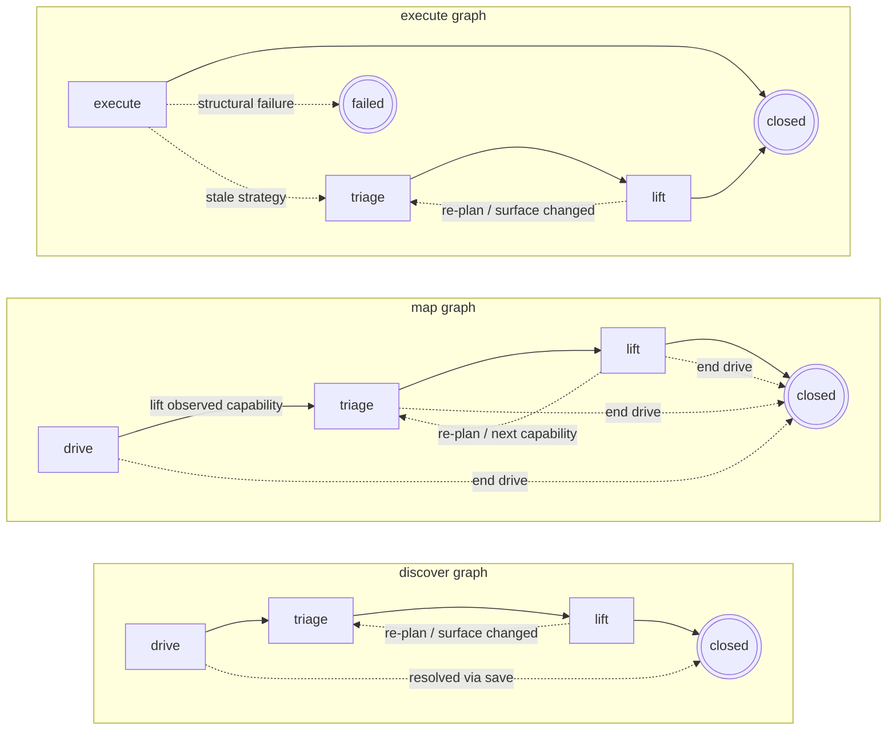

# Klura — Architecture

Klura turns a one-shot user request ("message adam on facebook") into a saved, reusable, fast skill. Each call goes through two phases:

1. **Discovery** — figure out how to do the thing on this site, save what you learn.
2. **Execution** — replay the saved strategy on every subsequent call.

This document opens with what happens in a single run, then summarizes the secondary capabilities that wrap that core loop, then points at the deep reference docs under `docs/` for everything else.

## The session FSM — three named graphs

Every session walks one of three declarative state machines. The `graph` parameter on `start_session` selects which:

| Graph | Topology | Use it for |
| --- | --- | --- |
| `discover` (default) | `drive → triage → lift → terminal{closed}` | Goal-directed reverse engineering. The standard reverse-engineering flow that dominates this doc. |
| `map` | `drive → triage → lift → terminal{closed}` | Surface mapping with an opt-in lift cycle for an observed capability. Mutating actions gate behind a per-(action, selector) consent checkpoint; auto-synth is skipped at close; the re-persistence gate fires at lower thresholds. The platform logbook accretes the surface map for future sessions. |
| `execute` | `execute → triage → lift → terminal{closed \| failed}` | Run a saved strategy as the whole session. On stale-strategy failure, the FSM auto-falls into triage with the failure as defense-surface input — the agent re-plans and re-lifts. Arg / auth / structural failures terminate `failed`. |


```mermaid
flowchart LR
  subgraph D["discover graph"]
    direction LR
    D_drive[drive]
    D_triage[triage]
    D_lift[lift]
    D_close(((closed)))
    D_drive --> D_triage
    D_triage --> D_lift
    D_lift --> D_close
    D_drive -.->|resolved via save| D_close
    D_lift -.->|re-plan / surface changed| D_triage
  end
  subgraph M["map graph"]
    direction LR
    M_drive[drive]
    M_triage[triage]
    M_lift[lift]
    M_close(((closed)))
    M_drive -->|lift observed capability| M_triage
    M_triage --> M_lift
    M_lift --> M_close
    M_drive -.->|end drive| M_close
    M_triage -.->|end drive| M_close
    M_lift -.->|re-plan / next capability| M_triage
    M_lift -.->|end drive| M_close
  end
  subgraph E["execute graph"]
    direction LR
    E_exec[execute]
    E_triage[triage]
    E_lift[lift]
    E_close(((closed)))
    E_fail(((failed)))
    E_exec --> E_close
    E_exec -.->|stale strategy| E_triage
    E_exec -.->|structural failure| E_fail
    E_triage --> E_lift
    E_lift --> E_close
    E_lift -.->|re-plan / surface changed| E_triage
  end
```

Solid arrows are the primary path; dotted arrows are alternate transitions (early resolve, explicit close, stale-strategy fall-through to triage, structural failure, re-plan back to triage when the user said no or `perform_action` crossed surfaces). Triage and lift do not branch on a "user approves" event — there's no `plan_rejected` in the FSM. The agent submits a plan via `submit_triage_plan`, the runtime fires an `ack_checkpoint`, and the agent reads `user_response` itself: re-submitting re-enters triage, RE moves transition to lift. Self-loops (`triage → triage` on `plan_submitted` / `surface_changed`) are omitted from the diagram for legibility — see [docs/session-phases.md](docs/session-phases.md) for the full edge list.

Surface plans bind the runtime-observed current URL plus navigations made after triage entry. The current URL is included explicitly because a navigation that raises `surface_changed` precedes the transition into triage; filtering solely by the triage-entry timestamp would otherwise discard the exact page the plan classifies.

Graphs are data, not code: `runtime/src/graphs/<name>.ts` exports each Graph literal (nodes, transitions, per-graph config). The dispatcher in `runtime/src/phases/state-machine.ts` is the only writer of `session.phase` and `session.status` — illegal transitions throw. Per-graph behavior (consent gates, auto-synth, re-persistence threshold) is declared in each Graph's `GraphConfig`, not as scattered `if` branches in the runtime. New graphs land as one new file under `graphs/`. Mermaid render via `runtime/src/graphs/dump.ts`.

Per-phase tool admissibility is likewise data on the tools themselves: every `ToolDef` declares a `phasePolicy` (category + per-tool extra phases + exhausted-set membership), and the phase tool catalog (`runtime/src/phases/tool-catalog.ts`) is a derived projection over `TOOL_REGISTRY` — the per-phase allowed sets, budget-exhausted sets, and the universal bypass set are all computed from those declarations, so a catalog entry without a registered tool is impossible by construction. `runtime/test/registry-parity.test.js` locks the projection down in both directions.

The `map` graph represents an explicitly authorized platform-onboarding run. Its triage plans and read-capability saves continue without per-capability user handovers, while its independent mutating-action consent gates remain active. Responses expose relay instructions only when a checkpoint handler actually requested a user handover.

Full FSM mechanics — admissibility, round budgets, transition events, the failure-gate guard — in [docs/session-phases.md](docs/session-phases.md).

---

## A run, end to end

```
                ┌────────────────────────────────┐
                │  start_session(url, platform,  │
                │  capability, args, graph,      │
                │  lift_mode)                    │
                └───────────────┬────────────────┘
                                │
                ┌───────────────▼─────────────────┐
                │ Load policy.json                │
                │  └─ if recorded-path cap →      │
                │     prior_decline (ToS lock)    │
                │ Load saved strategies           │
                └───────────────┬─────────────────┘
                                │
                  ┌─────────────┴──────────────┐
                  │                            │
              has saved                   no saved
              strategy                    strategy
                  │                            │
                  ▼                            ▼
        ┌──────────────────┐        ┌──────────────────────┐
        │ AUTO-EXECUTE     │        │ Return a11y + URL +  │
        │ ✓ if served      │        │  task_contract       │
        │   tier < fetch   │        │  (graph-aware)       │
        │   AND logbook    │        └──────────┬───────────┘
        │   has prior      │                   │
        │   lift_attempts  │                   │
        │   → revisit_     │                   ▼
        │   prompt         │      ┌──────────────────────────┐
        └────────┬─────────┘      │ DRIVE                    │
                 │                │  agent clicks, reads,    │
        user says│                │  inspects network/JS;    │
        yes      │ user says      │  captures accumulate on  │
        ─────────┴── no           │  the Session             │
        │             │           └──────────┬───────────────┘
        │             │                      │
        ▼             ▼                      ▼
   re-enter      close_     ┌────────────────────────────────┐
   LIFT    ────► session    │ end_drive                  │
                            │  1. synth recorded-path if no  │
                            │     save and action history    │
                            │     is rich                    │
                            │  2. flush captures, actions,   │
                            │     tool trace, bundles, and   │
                            │     storage-state to workdir/  │
                            │     <platform>/sessions/<sid>/ │
                            │  3. recompute derived signals  │
                            │     (field-stability, bundle-  │
                            │     history, signer-history,   │
                            │     known-modules)             │
                            │  4. compute unresolved caps    │
                            │     (no save AND no user cap)  │
                            └──────────┬─────────────────────┘
                                       │
                            ┌──────────┴───────────┐
                            │ unresolved? ─ no ─► close cleanly
                            │           ─ yes ─►   │
                            │                      │
                  ┌─────────┼──────┬──────────────┐│
                  │         │      │              ││
              explicit_   auto    skip            ││
              learn       │       │               ││
              (default)   │       │               ││
                  │       │       │               ││
                  ▼       ▼       ▼               ▼
            handoff:  handoff: close       (no handoff)
            "TRIAGE   "PLOW      cleanly
            + ASK":   THROUGH":
            agent    agent
            composes drives RE
            a quick  without
            trade-   pause
            off in   (benchmark/
            own      automation
            voice;   mode)
            user
            says
            YES→plow
            through;
            re_check_
            in at
            ~20 rds
            with
            progress
```

The same flow runs whether discovery or execution dominates — `start_session` either auto-executes (when a saved strategy exists for this `{platform, capability}` and its required caller params are present; sourced and `optional: true` params are excluded) or hands the agent a live browser to drive. Capability-prereq bindings preserve their typed values between capabilities instead of flattening objects and arrays to text. Optional capability prerequisites bind every declared output variable to `null` when their sub-call structurally does not run or fails, so downstream strategies can branch without unresolved placeholders; delivery-unknown remains terminal. `update_strategy` preserves the existing `notes` contract when an amendment omits that field, while explicit `notes: null` removes it. Captures accumulate on the `Session` object throughout. `end_drive` is where the runtime decides what to persist: if the agent saved nothing but the action history is rich, it auto-synthesizes a strategy; if the agent saved something but the captured traffic suggests a higher tier was reachable, it nags. Full mechanics in [docs/run-lifecycle.md](docs/run-lifecycle.md).

`start_session(graph: "execute")` uses a compact result surface: discovery artifacts, platform-map context, and abort history are omitted, while oversized structured bodies retain IDs, outcome fields, and item shape with long leaves clipped under an explicit truncation envelope. This keeps execution responses inside the MCP event budget without turning structured results into opaque text previews.

**Session teardown is one path.** Every module that stores session-keyed state (pending checkpoints/interruptions, paused recorded-path executions, auto-execute aliases, starter caches, session observations, logbook dedupe sets, capture journals, remote viewers) registers a named disposer on the session scope at its write site; `pool.endDrive` disposes the scope on every branch where the session id dies, so clean close, abort, pool eviction/shutdown, and error teardown share one disposal path with no per-caller cleanup lists. The scope also owns parent/child session topology — an auto-execute recorded-path pause adopts its inner session under the outer id, so closing the outer session closes the paused inner browser context first. Pool idleness is likewise one owner: `Pool.busy()` (live sessions OR warm slots) gates an edge-armed hibernation timer, never a polling tick, and the daemon's `runtime.idleTimeout` shutdown consults the same predicate — a live warm pool keeps the daemon process alive even with zero active sessions. See `runtime/src/pool/session-scope.ts` and [docs/pool.md](docs/pool.md).

---

## Execution strategies — at a glance

| Strategy | When it's picked | Subdir on disk |
| --- | --- | --- |
| `fetch` | Static templated HTTP call. May declare `prerequisites` for values the caller doesn't supply (CSRF, persisted-query IDs, opaque IDs). Rides Node or in-page fetch based on the `transport` stamp | `~/.klura/skills/<platform>/fetch/` |
| `page-script` | The request can't be expressed as a static template — JS runs inside the page to build and fire the call per-invocation (in-page signer, frame-from-page, fingerprint-bound re-signing) | `~/.klura/skills/<platform>/scripts/` |
| `recorded-path` | No usable API, or we're still in the process of finding it out — replay the UI interaction step by step | `~/.klura/skills/<platform>/paths/` |

`prerequisites`, `transport`, and `protocol` are properties of a strategy, not separate tiers. Browser prerequisites share one session with the request, and their navigations enter the shared local origin scheduler and request deadline. A token-producing `js-eval` reuses a matching page only after the document has settled past its loading state. When `response.from` selects a `js-eval` binding as the capability result, execution bypasses the token cache, ensures the page is at the exact resolved caller URL, and evaluates fresh on every call. Save-time `js-eval` probes resolve per-call `args_template` values from the live capability declaration, then documented parameter examples, with safe stand-ins for missing or credential-shaped inputs. Cascade order on degradation: `fetch` → `page-script` → `recorded-path`. Full schemas, the prerequisite methods, and the graduation pipeline live in [docs/strategies.md](docs/strategies.md). Token lifecycle (CSRF refresh, OAuth, cookies, listener auth) lives in [docs/tokens.md](docs/tokens.md).

Most sites graduate from `recorded-path` to a faster sibling once discovery converges, but not all: pure DOM interactions with no network equivalent (canvas editors, in-page tools), OS- or extension-mediated flows (wallet popups, passkey dialogs), and legacy intranets where the "action" is a real browser event rather than a replayable API call stay at `recorded-path` by construction. That's the correct saved shape for those capabilities, not a failure mode. See the "When graduation doesn't happen" note in [docs/strategies.md](docs/strategies.md).

---

## Secondary capabilities

These wrap the core loop but aren't part of every run.

**Discovery.** The LLM drives the browser; the runtime captures everything that happens underneath and helps the agent classify the highest viable tier from intercepted traffic. The CDP network stream keeps passive Script resources in a dedicated session ledger, separate from the compact data-request log, so source discovery remains complete across document navigations without flooding `get_network_log`. When captures don't explain the bytes (binary WebSocket frames, signed bodies, persisted GraphQL), a reverse-engineering pipeline lets the agent read the page's own encoder. See [docs/discovery.md](docs/discovery.md) and [docs/reverse-engineering.md](docs/reverse-engineering.md).

**Listeners.** Some capabilities are subscriptions, not request/response — incoming messages, status changes, notifications. Klura ships four listener transports (`websocket`, `sse`, `poll`, `browser-event`). Browser-event holds a long-lived Playwright page open and forwards every WS frame the page receives, which is the only path that works for fingerprint-bound push channels. See [docs/listeners.md](docs/listeners.md).

**Public collection surfaces.** A signed package can declare `public` capabilities and safe-read `internal` helpers. Only public capabilities are indexed, shown, called, or started as runs. A public collection may root in an internal page task that shares its authentication realm; the helper remains in the verified package artifact but is not part of the consumer-facing catalog. This lets a package expose one simple operation while retaining pagination and detail mechanics as explicit, reviewed graph edges.

**Reviewed public page scripts.** The public package ABI has one executable read profile for capabilities that depend on page-owned JavaScript. `browser_page_script` binds exact reviewed source bytes into the signed manifest and runs them through a non-replaceable main-world runner installed before target scripts in one isolated Chromium page. Public Chromium requires its OS sandbox; launch failure is `browser_unavailable`, never a silent `--no-sandbox` fallback. The runner captures pristine validation intrinsics while preserving the saved local `js-eval` contract's access to page-defined globals. The profile is unauthenticated, has exactly one navigation origin, keeps navigation and preparation on that origin, admits only same-origin signed GET/POST XHR or Fetch rules during the program, accounts request bodies against both program and enclosing browser-policy ceilings, and seals browser egress when the awaited program returns so deferred work cannot escape as an ordinary resource. Browser resource `POST` traffic has signed per-rule, per-request, and whole-task body limits. Resource-phase CDP `Ping` traffic, including `navigator.sendBeacon`, is represented by the exact signed resource type `ping`; CDP `Other` is not a public resource type and is blocked. A CORS `OPTIONS` request is derived only from one exact signed resource Fetch/XHR rule via CDP's structural preflight fields, carries no body, and consumes ordinary request and wire budgets; preflights cannot independently widen egress. A context-wide guard aborts popup-target traffic before it can bypass the page-scoped CDP policy. The program must return a bounded plain JSON object or array matching its signed result kind and required keys; the sealed runner encodes it and the host strictly reparses and rechecks the bounded JSON. Its closed runner envelope maps byte overflow to `response_too_large`, shape violations to `response_contract_mismatch`, and source execution failure to transport failure without interpreting exception text. Classification uses a deterministic synthetic JSON response and still comes exclusively from the package's structural outcome contracts. The factory compiler derives the source digest, and its strict local exporter accepts only the saved `page-script` subset backed by one main-frame, per-call `js-eval` result whose placeholders are proven required and scalar by the destination input schema. Egress rules, limits, schemas, outcomes, review, signing, and publication remain explicit maintainer decisions.

**PR-ready platform export.** `exportPlatformPackageToTools()` reads the explicitly reviewed subset of active saved capabilities for one platform and accepts a public contract for the information runtime cannot infer: typed outcomes, exact egress and traffic budgets, catalog metadata, page-script review settings, and kind-discriminated fixture inputs (`call`, plus `run` with `caller_bounds` and `input_mode_id`). Unreviewed local capabilities remain internal primitives and are not added to the package. Fixture coverage is planned from the shared public fixture contract (`public/contracts/fixture.ts`) — the same parser, file-name grammar, and coverage planner the tools-repository verifier and the export reviewer consume — so every capability requires a call fixture and every collection capability additionally requires a run fixture, audited before any smoke traffic. It requires post-save semantic verification, compiles the reviewed package, executes every call fixture through the ordinary public consumer boundary, and executes every run fixture as one bounded local collection run with serialized target executions so recorded response order replays deterministically. Only after every call fixture produces a declared success outcome and every run fixture a completed scrape outcome — and each captured fixture file round-trips through the public fixture contract — does it atomically create `tools/<package_id>/` with source, registry metadata, and captured call and run fixtures. Before the atomic rename, the shared export-tree module snapshots every regular file and directory under the staging root into sorted relative POSIX paths, byte counts, per-file SHA-256 digests, and one canonical tree digest. Symlinks, path escapes, non-regular nodes, and unstable file reads are typed failures. The manifest is returned outside the exported directory, avoiding a self-referential digest while covering every file inside it. Generated review, preauthorized review, actor grading, and cached reuse call the same assessor and require the exact package source, registry metadata, declared fixtures, and complete directory tree; any added, removed, or changed node invalidates the result before grading. An audit failure writes no package files; the exporter never signs, installs, publishes, or performs a Git operation. The written `registry.json` and the created directory shape are governed by two shared contracts rather than per-reader string conventions: `public/contracts/registry-catalog.ts` owns the catalog manifest parse (`RegistryCatalogManifestV1`), the release source-path grammar (`package.source.json` or `releases/<version>/package.source.json`), and the per-release catalog projection the static-registry compiler consumes, while `factory/public-package/tools-layout.ts` owns the layout constants and path predicates (`TOOLS_PACKAGE_LAYOUT_V1`, `isAllowedToolsRepositoryPath`) that the tools-repository PR path gate, static registry builder, fixture verifier, and bench export reviewer all read. An installable release must declare a `runtime_range` that includes the exporting runtime, and the static registry build re-asserts the same invariant against the building runtime, so a signed compatibility promise is published only when its fixtures were verified under a runtime inside the promised window.

**Maintainer review projection.** Tools-repository pull requests are reviewed against one runtime-owned projection (`consumer/registry/review-projection.ts`) that is exhaustive over strategy tiers: `http_request` projects its complete typed request, `browser_navigation` its URL, wait, interaction, and DOM projection, and `browser_page_script` its entire program — reviewed source verbatim, source digest, arguments, result shape, expected egress rules, and request-body limits — so page-script code changes render as readable diffs, never as opaque digest churn. The strategy switch has a `never` default and each contract's keys must appear in the projection or in the explicit omission record, so a new strategy kind fails compilation and a new contract field fails the key-exhaustiveness test until review makes an include-or-omit decision. The tools-repository scripts are thin delegates over these exports, and their fixture replay harness stubs every `PublicCallerV1` executor slot, so registry verification replays recorded responses and never reaches a live browser or network.

**Typed cursor envelopes.** A collection can expose a cursor only through a declared outcome `json_object` projection that names both the typed item map and the exact response JSON pointer holding the cursor. Pagination selects it from a typed outcome ID; it never parses link text or invents continuation state.

**Entity assertions.** A scalar outcome may bind a returned entity to either one exact caller-input pointer or a closed expression made only from caller input and literals. The assertion language has no response-text matching, secret bindings, or executable code, so a `200` for the wrong entity remains a verification failure rather than a successful call.

**Runtime build identity.** `npm run build` compiles TypeScript into a fresh sibling staging directory and writes a deterministic `build-info.json` that binds the source bytes to exactly that staged executable and declaration tree. Only a successful compile plus metadata pass replaces `dist`; a failed staged build preserves the previous distribution, while outputs removed from the source cannot survive as legitimized orphan artifacts. Runtime and MCP test lifecycles build before importing `dist`. An MCP process verifies source and artifact digests at startup, advertises the full build ID in its standard server description, and verifies the loaded ID, exact artifact digest, and checkout source digest when present before every protocol request, including initialization and ping. A source edit without a build, an artifact edit, or a different build replacing the files beneath a live process therefore fails closed and requires the matching build or process restart; file mtimes are not evidence of freshness.

**Factory execution classification.** Local factory strategies do not carry the signed outcome contracts that public packages use. One structural classifier produces six closed outcomes from runtime execution state, HTTP status, and a boolean `body.ok`: `explicit_success`, `explicit_failure`, `transport_accepted`, `transport_failure`, `not_run`, and `delivery_unknown`. False overrides HTTP 2xx; true is explicit local success; a 2xx response without that field is transport-only and remains visible to the LLM for semantic judgment. `not_run` means no target request was sent. `delivery_unknown` means a write may have been sent but was not acknowledged, so runtime neither retries nor cascades it and the caller reconciles through a read when possible. Node marks a mutation-shaped HTTP call dispatched when `fetch()` is invoked and retains the dispatch count across redirects; a deadline, transport failure, or later-hop scheduler rejection then becomes `sent_unconfirmed`. Only a scheduler rejection before the first invocation is structurally pre-dispatch. Browser drivers report `not_sent`, `sent_unconfirmed`, or `response_received`; older drivers that omit the field fail closed for mutation-shaped failures. Explicit failure and the two neutral execution states are not cached, marked healthy, or accepted as capability prerequisites. Ordinary execute does not infer that a strategy is broken from a domain result. Runtime-owned verification may suppress health, archive, transport-demotion, and replay state for the complete nested capability graph, so a grader cannot damage the strategies it is measuring. Post-save browser verification additionally runs behind a run-scoped fresh-context pool facade: no discovery or ready page, warm slot, shared js-eval cache, or persisted storage is visible; contexts are keyed by platform and identity as the warm pool keys them, so a prerequisite side effect survives the steps that depend on it while a cross-platform prerequisite or second identity gets its own cookie jar; `endDrive` is a no-op for run-owned sessions, and every context is destroyed exactly once when the run unwinds. Published calls and runs use the manifest outcome evaluator instead, with no response-text fallback.

**Empty declared collections.** Collection emptiness is not a seventh classification. A separate strategy-aware assessor, consulted only where strategy bytes are in hand, reports whether a declared collection came back with zero elements. Declaration is structural, in descending explicitness: a `response.extract` key with `multiple:true`; a `response.from` binding whose prerequisite declares `return_shape.kind:"array"`; or, derived, an object body with at least one array-valued own property where every array-valued own property is empty. The derived source covers a page script assembling its own result envelope. Only own properties are read, never key names, and an uninspectable body is never an empty collection. An explicit `body.ok:true` over such a result carries the strength of a bare 2xx and no more: post-save verification stamps `transport_passed`, withholds promotion and heal, and routes a candidate to semantic review, whose response re-derives the reason from the same digest-bound bytes; the execute cascade withholds the proof stamp while still marking the tier healthy, because an empty read is a transport success. `js-eval` prerequisites may declare `return_shape.kind:"array"` with an optional `min_items`, and an empty array satisfies the shape unless `min_items` says otherwise, so zero rows reaches the review gate instead of failing as a transport error.

**Broken-tier probation.** A `broken` tier is skipped before it runs, so it appends no further outcome and its health record freezes — a tier that broke during an outage would stay quarantined after the site recovered. The executor therefore consults a probation policy instead of a bare `isBroken` test: past `pool.brokenProbationHours` since `max(lastFailure, lastProbeAt)` the tier runs once as a probe and the outcome re-decides its health like any other execute. The check is lazy, at execute time, never a timer, and nothing happens to a strategy nobody calls. The clock is stamped immediately before the probe rather than after it, because `not_run` and `delivery_unknown` return without touching health by design and would otherwise leave the probe re-firing on every call. A skipped tier names its next probe time in the cascade trail, and `get_strategy_health` derives `quarantined` / `probe_eligible_at` from the same policy function the executor uses. Post-save verification of an active strategy records the verified tier as healed on explicit success — the same write the candidate path already made — so a re-saved strategy does not inherit the broken record of the bytes it replaced; healing and health reset also clear that capability's rediscover silence.

**Replayed abort history.** `abort_events[].kind` is the classification an agent passed to `abort_session`, never a runtime detection, and the ledger is replayed to every later session on the platform. Each entry therefore records provenance: `runtime_observed` when the runtime's own origin-blocked detector fired on the aborted host during that session (its advisories are retained on the session and matched by host, and the entry carries the structural signals), `agent_asserted` otherwise and for every historical entry. The escalation signal scores rather than counts — deduped by session id, weighted by provenance times a whole-half-life recency decay, both factors configurable — so three corroborated aborts on one root cause still escalate at full strength while three uncorroborated claims do not. Its advisory states the mix and that agent-asserted entries are claims, asserts nothing about the site's current behavior, and defers the remedy list to the origin-blocked advisory that owns it. The ledger is bounded at write time by TTL, newest-duplicate suppression, and a ring buffer.

**Exact post-save proof.** One canonical module owns the post-save proof schema, strategy digest projection, verifier contract version, and typed assessor. A proof binds platform, capability, exact tier, and canonical committed strategy bytes. Runtime build identity is recorded as provenance, while the stable verifier contract controls semantic freshness, so an unrelated rebuild does not invalidate every proof. Commit and proof capture share one capability mutation lock. Successful stamping and failure archival each compare the proof to the active bytes and apply their mutation under that same lock, so a competing save can only make an older verification stale; it cannot receive the result or be archived by it. Save verification, candidate promotion, public export, and actor grading call the same assessor; none reimplements freshness. A normal explicit-success execution refreshes the proof for the exact executed strategy server-side, without another save or an LLM-supplied proof field. Missing, malformed, scope-changed, artifact-changed, and verifier-changed proofs remain distinct structural outcomes.

**Read-candidate activation.** An automatically verifiable, non-mutating `fetch` or `page-script` save is persisted outside the active skill tree under a full SHA-256 candidate identity. Eligibility requires a recursive structural safe-read proof over the exact capability/tag prerequisite graph and every active target tier. Cross-platform edges retain their declared platform; mutation, authentication, cycles, missing or ambiguous providers, WebSockets, recorded paths, and opaque browser actions fail closed. A candidate with complete arguments but an indeterminate dependency graph is staged inactive and routed through `post_save_validation_consent`; consent executes those exact immutable candidate bytes and promotes only on explicit success, while decline or an unattended `continue` leaves the prior active strategy unchanged. A consented promotion is recorded in the authoring session's save ledger and clears that capability's stale marker, so end-drive evaluates the promoted save rather than the pre-promotion session state. A read-shaped `js-eval` prerequisite delegates its semantic judgment to the authoring LLM and remains eligible unless the surrounding strategy carries a structural mutation signal. Verification arguments are checked against the canonical placeholder inventory and its exact optional-omission rules. When a capability already has an active strategy, a read replacement that cannot be verified automatically is still staged inactive rather than overwriting the active bytes. The executable candidate bytes remain immutable; a candidate-bound sidecar records verification evidence and binds the capability's active-state digest or explicit absence at staging. The verifier executes only those exact bytes in a fresh anonymous browser context with health, archive, transport counters, shared browser caches, authoring-session state, and tier fallback suppressed. Explicit `body.ok:true` promotes immediately and records the promoted tier as healed, so a content-addressed replacement never inherits the prior candidate's broken health state — unless the result is an empty declared collection, which stays inactive with the same handling as a transport-only 2xx. A transport-only 2xx remains inactive and stores an immutable exact response-evidence artifact plus its SHA-256 digest; `review_strategy_candidate` pages that evidence within the MCP budget and mints a short-lived token bound to candidate bytes, evidence digest, classification, and active baseline. The LLM submits one of `verified_success`, `verified_failure`, or `inconclusive` with a rationale. Runtime validates only the enum, token, hashes, and CAS binding and never interprets the rationale or response prose. Only `verified_success` may promote.

**Browser-state durability.** Every successful `perform_action` is a storage-state checkpoint for the session's platform and identity, in addition to the existing close-time persistence. A later session can therefore inherit cookies and local storage immediately without depending on agent-controlled close ordering. Persistence failure is returned as a typed advisory and never turns an already-dispatched browser action into a thrown failure that could invite a duplicate mutation.

Promotion rechecks the full candidate and evidence digests and, under a per-platform/capability filesystem lock, compare-and-swaps the current active state against the bound baseline before atomically writing one complete active strategy. Every active writer for that capability—validated commit, tier demotion, archive/unarchive, runtime-metadata stamp, migration, and step patch—uses the same fail-closed cross-process lease and atomic-write protocol, so none can land between the promotion baseline check and rename. The lease records a schema version, PID, per-process nonce, held-file owner marker, and creation time. Recovery requires both PID liveness and proof that that exact process still holds the nonce-bound marker, so PID reuse cannot preserve an abandoned lease; a recovery guard serializes the final recheck. Fresh malformed locks fail closed and aged malformed locks are recoverable. Explicit or reviewed failure, inconclusive review, transport failure, `not_run`, `delivery_unknown`, byte tampering, or a stale baseline preserves both the current active strategy and the inactive candidate.

**Execute-time placeholder closure.** Save-time reference validation is followed by a transport-boundary assertion over resolved request URLs, bodies, headers, capability-prerequisite arguments, browser prerequisite fields, recorded steps, and WebSocket URLs and frames. URL templates normalize both `{{name}}` and syntactic REST-style `:name` parameters before exact resolution, so a missing REST parameter cannot reach transport as a literal. Declared caller and prerequisite values support own-property paths such as `{{searches.0}}` and `{{result.items.0.id}}`; prototype-bearing path segments are rejected. Literal provenance resolves a nested caller reference through its declared root and resolves positional aliases through declaration order, matching the executor's accepted surface. A remaining template token is a typed `unresolved_placeholders` failure before any request or browser action. Whole-value body and prerequisite-argument placeholders preserve JSON input types; embedded placeholders remain string interpolation. A missing declared-optional query parameter is removed only when its complete value is exactly one placeholder; optional body, header, capability-argument, and per-call fields use the same recursive whole-value rule. An explicitly empty array or plain object also omits exact nested references beneath its declared-optional root, so mode-specific prerequisites do not fire merely because callers normalize an absent collection to `[]` or `{}`. Embedded placeholders and array elements fail closed because omission would alter field or positional meaning. Optional capability prerequisites omit unavailable bindings and skip a structurally `not_run` target, allowing one public capability to compose mode-specific prerequisites. `delivery_unknown` still stops the parent because the prerequisite may have mutated state. A `response.from` dependency on a missing optional binding fails structurally, and a blank JSON direct result is never reported as a successful empty body.

**Execute-time enum grounding.** Inline `notes.params.*.observed_values` are a closed admissible set for caller enum arguments. Each entry requires `value`; the optional human-facing `label` defaults to `value` everywhere the set is normalized, matched, or returned in a typed `unobserved_enum_arg` rejection. Case-only normalization may select the unique observed spelling, while other unmatched values fail before target traffic.

**Consumer collection runs.** The dependency-clean consumer entrypoint executes only installed, signed public collection contracts. A call, run, or resume for one local home shares the same process-local origin scheduler. Trusted local HTTP(S) dispatches with a declared target URL use that scheduler and a local per-request deadline under the `traffic.*` limits; Node follows at most five redirects with an independent admission for every hop, Node and in-page browser fetches abort at that deadline, and first-party browser navigations pass it to the browser driver. A Node WebSocket handshake uses that same HTTP(S) origin admission for its entire bounded lifecycle. Factory and consumer work therefore cannot independently over-admit or indefinitely retain one origin. `run` may select only a declared populated input mode and lower only declared caller limits. A run materializes structural roots, assigns each node a durable output ordinal before enqueue, and dispatches FIFO-ready nodes concurrently only within a bound derived from signed concurrency and reorder-buffer limits. Each item buffer binds the node/page/item hierarchy position and each ledger commit has a contiguous item sequence, so recovery rejects reordered commits, sequence gaps, duplicate node ordinals, and a sink prefix beyond the committed item sequence. The runtime reserves every waiting chain's signed maximum result envelope before target traffic, follows bounded per-node pagination, expands validated parent items through an acyclic fan-out graph, and sends every target request through the same typed HTTP boundary and scheduler. Attempt observations, items, fan-out, and node completion commit in stable dispatch order even when calls finish out of order. The factory compiler derives an inline item-output bound only from a schema that proves one, and public-package validation recomputes it. Before an inline run creates metadata or sends traffic, its proved bound, 100-item ceiling, and fixed envelope must fit the active adapter ceiling; otherwise it returns `output_sink_required` and the caller uses a file sink. A semantic date cutoff is allowed only where the graph proves one once-seeded ordered page chain with no fan-out; it compares the signed ISO/RFC 3339/integer representation exactly, rejects observed ordering drift as `item_invalid`, and finalizes the retained prefix as `date_cutoff_reached` before another page can start. Its SDK accepts an abort signal and every execution epoch creates the signed total deadline; both halt new dispatches and reach in-flight typed calls, while terminal journal state distinguishes `cancelled` from `deadline_exhausted`. A resume can repeat an unresolved request only after the immutable task capability proves every strategy `safe_read`; it journals that authorization before target traffic. A durable operation record binds every start, resume, cancel, and discard operation ID to its canonical arguments, reserved run ID where applicable, and canonical result; retries replay that result and never repeat the mutation. It records every child enqueue before completing its parent node, so a completed parent never silently loses declared downstream work. It reserves terminal journal frames before ordinary work and charges identity plus retained parent-item state together across every concurrent chain against signed local-memory bounds. It writes items to a local canonical spool before committing their references to a hash-chained run journal, and exports only committed records as canonical JSON, canonical NDJSON, or a signed JSON-pointer CSV projection. The run result itself remains a small identity-bound summary. See [docs/consumer.md](docs/consumer.md).

**Consumer input contracts.** Every consumer tool input shape and bound is defined once in a shared contract module (`consumer/contracts/tool-contracts.ts` over the constants in `public/contracts/consumer-bounds.ts`). The published MCP input schemas are generated from those contracts, and the SDK, daemon wire routes, and CLI validate against the same definitions at their own boundaries; the domain caller-bounds parser reads the same constants, so adapter-accepted caller bounds equal what run planning admits. See [docs/consumer.md](docs/consumer.md).

**Consumer registry catalog.** The consumer registry cache verifies an Ed25519-signed index before catalog projection. The CLI and daemon both use the runtime-pinned `https://registry.klura.ai/v1/index.signed.json` authority and its compiled public key; callers cannot substitute either value. Registry search examines only normalized signed package, domain, tag, and capability fields, orders matching package IDs deterministically, and binds pagination cursors to one exact cached index digest. A cursor never refreshes or crosses an index update; it reports a stale cursor when that source is gone. Catalog `show` resolves and verifies the exact immutable package before exposing its public contract, but never activates it locally. `ConsumerRegistryServiceV1` exposes search, show, and install through one canonical typed-adapter boundary.

**Stored run inspection.** Read-only consumer inspection verifies the metadata binding in the first journal frame and the closed terminal frame before reporting a terminal result. Every snapshot carries the highest durable journal sequence as `state_version`. The MCP state wait uses the exact journal file's event source to wait once for a version advance, bounded by one local timeout; it does not infer a transition from elapsed time or poll local state. A missing terminal frame stays `nonterminal`; local inspection does not infer a completion or an interruption reason from timing, text, or filesystem shape.

**Journal ABI.** Durable journal frames carry a closed structural event union. Each accepted task completion is tied to one observed attempt, each item commit to its own buffered reference, and each duplicate to a prior committed identity. Those records make the run summary exactly reconstructible before a resume. Recovery validates every event as it verifies the length prefix, canonical bytes, checksum, sequence, and hash chain; unrecognized event data is corrupt local state, not an invitation for runtime interpretation.

**Durable frontier records.** The first run frame carries ordered spool references to every complete initial root state; recovery loads those roots before it processes later lifecycle records. Every later enqueued collection node carries a deterministic node ID, canonical logical-key digest, and data-spool reference to the complete node state. The reference is durable before the journal event, preserving the exact pending-work input needed by later recovery without inspecting response wording or generating a new route. A resumed parent recognizes a child node ID already present in that durable set and does not append a duplicate child record.

**Durable reorder buffers.** Each waiting chain reserves the larger of its signed call envelope and signed whole-page output ceiling before target traffic. A later result may write its validated item buffers first, but only the contiguous logical prefix can commit item sequences, dedupe identities, or reach an output sink. The journal binds each buffer, commit, and duplicate resolution to one structural node/page/item position; safe-read resume reconstructs unresolved buffers from verified spool bytes and rejects a replay that changes one.

**Terminal journal allowance.** Before an ordinary frame is written, the journal retains five emergency bodies of 65,536 bytes with their exact 4-byte length and 32-byte digest framing. Emergency writes consume that reserved portion only and reject a body above the declared maximum.

**Node lifecycle records.** Intent, observation, skip, and completion frames name the durable node ID. Recovery can derive pending, observed, and completed work entirely from those closed records rather than a timer, an HTTP status convention, or a site-specific classifier.

**Recovery gate.** Before resume machinery may schedule work, it reconstructs the node set from durable node blobs, verifies every logical key and lifecycle transition, and requires event-referenced blobs to form the complete contiguous spool prefix. It never dispatches target traffic; after verifying that prefix, it durably discards only a trailing spool suffix with no accepted journal reference.

**Pagination checkpoints.** An accepted page that has a declared continuation commits an updated node blob containing the next input, canonical seen-input digests, and page count before its next dispatch. The journal has an explicit `node_progressed` event for that checkpoint, so a recovery path never reconstructs a continuation from response prose or reruns the root merely to rediscover a cursor.

**Local resume.** Resume acquires a per-run local lease, reconstructs only the digest-verified pending frontier and accounting state, appends a new execution epoch, and only then sends target traffic. Its immutable artifact carries the signed runtime range as well as the package digest; the consumer facade verifies the range before reopening that exact package rather than the package currently selected by `installed.json`.

**Run inspection.** `runs list` is a read-only consumer surface ordered by immutable creation time and run ID. A journal-corrupt run is represented as a quarantined entry while intact runs remain visible; corrupt metadata remains a local-state error because no trustworthy summary exists. `runs items` reads an exclusive bounded page of durably committed item events without dispatching target traffic. `runs resume <run-id>` is the explicit local continuation route for a structurally resumable run.

**Mid-flow events — checkpoints and interruptions.** Two distinct dispatch surfaces, picked by who detects the event. **Checkpoints** (`runtime/src/checkpoints/`) are runtime-detected events with a closed `kind` enum — round-budget thresholds crossed, a recorded-path step threw, post-save validation about to fire. The runtime already knows what happened, so dispatch is direct: invoke whichever plugin claimed that `kind`. **Interruptions** (`runtime/src/interruptions/`) are agent-detected ambient page state — login walls, CAPTCHAs, 2FA, ToS prompts. The agent describes what it sees, the registry routes by description match, whichever handler claims it picks the resolution (resolved inline, continue silently, or hand off to a human via the remote viewer). Either path can pause the agent, but only one knows the event-kind upfront. The site sees the daemon's IP throughout — no fingerprint mismatch.

**The save-strategy audit.** Every strategy producer funnels through a single `Audit` instance (`runtime/src/audit/`) that composes structural detectors and token-gated classifiers under one rejection envelope — adding a new save-time concern is one Detector or Classifier spec entry, not a new gate. The save policy (`runtime/src/audit/lift/save-policy.ts`) is the one entry all five producers call — the attended agent pipeline, both end-drive auto-synth passes, graduation, and the programmatic API — with per-producer differences expressed via a vocab `SAVE_ORIGINS` origin: the agent path takes the full token flow, unattended origins run the detector bank per each detector's `unattendedPolicy` (blocking invariants refuse persistence, advisories decorate `runtime_meta.save_warnings`), and programmatic embedder saves demote blocking to warnings. Facts shared between audit issues and the authoring contracts (slug collisions, citeable artifacts, tier rank, triage verdicts) live as concern modules under `runtime/src/audit/concerns/`, with detector↔constraint parity enforced by test. Lookup composition is structural: first-class `search_*`, `lookup_*`, and `list_*` capabilities own their retrieval surface, while downstream capabilities reuse them through capability prerequisites. See [docs/checkpoints.md](docs/checkpoints.md), [docs/interruptions.md](docs/interruptions.md), [docs/remote.md](docs/remote.md), and [docs/gates.md](docs/gates.md).

**Authoring input fidelity.** Capability declarations preserve JSON-valued caller inputs across `start_session`, `declare_capability`, and map-mode `lift_observed_capability`. Scalar strings feed capture-literal templating; arrays and objects remain available to explicit authoring through the same own-property placeholder paths execution supports. Parameter documentation accepts JSON examples and classifies structured inputs as `kind: "array"` or `kind: "object"`, so a valid runtime input does not have to be misdeclared as scalar text merely to pass save validation. `update_strategy` delegates to the complete save pipeline but retains its own tool identity in every audit retry envelope, so an amend started in drive or execute can be retried with the admissible tool instead of being redirected into a phase-inadmissible create call. Whenever either authoring verb targets an existing capability, its URL-grounding audit accepts a URL only when it was observed in the current session or resolves identically at the same structural path in the active strategy; newly added or changed URL fields still require fresh observation. A full-body amend may round-trip the `runtime_meta` returned by `get_strategy`; `update_strategy` discards that runtime-owned field before validation and stamps authoritative metadata on commit, while `save_strategy` remains strict for new agent-authored strategies. Post-save previews prioritize runtime-owned failure evidence ahead of large incidental payload fields while the candidate-bound artifact preserves the full result.

Optional structured inputs apply to their exact nested placeholder paths as well as the root value. If `searches` is declared optional and absent, an object field or exact query/header value containing only `{{searches.0}}` is omitted structurally; embedded forms remain unresolved and fail before transport. Read-candidate eligibility uses the same root-aware rule, so save-time verification and warm execution cannot disagree about whether an omitted nested value is admissible.

**Observed-value provenance in URLs.** A click-correlated value constrains a literal URL only when it occupies a complete query-value or pathname segment. Incidental substring overlap with a hostname or path token is not treated as an enum choice. Exact placeholder validation and the remaining literal-provenance checks still apply before save.

**Lift interaction continuity.** `perform_action` remains admissible after triage hands the session into lift. Reverse engineering may require another UI interaction to generate the target request or rendered state; entering lift does not force the agent to abandon that browser context or reproduce the interaction through injected JavaScript.

**Schema-driven validation.** The runtime validates everything the LLM emits against canonical [zod](https://zod.dev) schemas in `runtime/src/strategies/schemas/` — strategy shapes, prerequisites, notes, response specs, websocket frames, recorded-path steps. The same schemas drive both the save-time gate (rejection envelopes) and the agent-facing surface: every shape error inlines the expected schema (via `describeShape`), and the `submit_triage_plan` ok-response carries a `save_strategy_schema` block live-rendered from the same Zod source. One source of truth — no drift between validator and prompt. The identifier vocabularies underneath the schemas — strategy tiers (`STRATEGY_TIERS`), prerequisite kinds (`PREREQ_KIND_VALUES`), and session outcomes (`SESSION_OUTCOMES` plus the `SAVED_OUTCOME_BY_TIER` tier→outcome map) — live once in `runtime/src/vocab/index.ts`; the Zod registries are keyed by them with `satisfies Record<...>` coverage, TS unions derive from the vocab types, and MCP tool enums spread the same arrays, so adding or renaming a tier or kind is a single vocab edit that tsc cascades everywhere. See [docs/validation.md](docs/validation.md) and [docs/strategies.md](docs/strategies.md).

**Capability composition.** Klura has no workflow engine. The LLM is the orchestrator: it reads `list_platform_skills`, recognises that one capability's output feeds another's input, and calls `execute` twice. The runtime's job is to make each capability fast; the LLM's job is to compose them. See [docs/composition.md](docs/composition.md).

**Local identity and configuration state.** Writes to `~/.klura/identities.json` and `~/.klura/config.json` stage complete owner-only files at mode `0600` and atomically rename them into place. An update therefore repairs a permissive destination mode instead of inheriting it. See [docs/storage.md](docs/storage.md).

**One lock primitive, one stale-recovery policy.** Every cross-process lock in the runtime — the per-capability mutation lock, the consumer session/resume/operation/activation locks, the daemon-start lock, the daemon singleton lock, and the `<file>.lock` guards on shared JSON state — is the owner-file lock in `runtime/src/utils/owner-file-lock.ts`. One policy decides staleness everywhere: an owner record with pid + process nonce, ESRCH-based liveness (EPERM means live), open-descriptor marker verification to close the pid-reuse hole, a 30s mtime grace before a malformed lock becomes recoverable, and recovery serialized through a `.recover` guard. Shared mutable JSON files (per-platform `health.json` and `logbook.json`, token caches, graduation state, storage-state cookie jars, `config.json`, `identities.json`) mutate only through the serialized read-modify-write helper (`updateJsonFile`), which pairs that lock with an atomic random-suffix-tmp rename — concurrent writers cannot lose each other's updates and a crash cannot tear a file. The daemon holds a KLURA_HOME-wide singleton lock for its lifetime, acquired before consumer-run startup recovery, so a second daemon can never append to journals a live daemon owns or unlink its socket. Lock order is fixed: graduation → capability mutation → per-platform logbook/health/storage-state; code holding a lower lock never takes a higher one. See [docs/storage.md](docs/storage.md#locking-and-shared-state-mutation).

**Portable secret references.** A strategy may persist an exact `{{secret:<scheme>:<ref>}}` token in an executable string field. Save-time validation checks the token structurally without consulting local resolver configuration, and the literal-provenance audit excludes it from caller-input classification. The executor and validator share one parser, including dash/underscore scheme names; the executing machine resolves the token through its locally configured command only at call time. Mixed or malformed secret-reference strings are rejected before save. See [docs/credentials.md](docs/credentials.md).

---

## Deep reference

| File | Topic |
| --- | --- |
| [docs/principles.md](docs/principles.md) | Design principles (plumbing vs intelligence, validate-everything-the-LLM-emits, "if the LLM keeps making the same mistake, the runtime is wrong"). Inspiration & prior art. |
| [docs/run-lifecycle.md](docs/run-lifecycle.md) | The per-call lifecycle in detail, `lift_mode`, `~/.klura/config.json` settings reference, CLI-only controls. |
| [docs/configuration.md](docs/configuration.md) | Every `~/.klura/config.json` field, the MCP `describe_config` / `configure` / `restart_runtime` tools, programmatic `createPool` overrides, and the legitimate `KLURA_*` env vars. |
| [docs/logbook.md](docs/logbook.md) | The per-platform logbook: cross-session memory backing the inline triage bundle on end_drive's RE handoff, `get_platform_logbook`, the revisit prompt, and `lift_mode`. On-disk layout, schema, writers, readers. |
| [docs/strategies.md](docs/strategies.md) | Strategy shapes, prerequisite methods, how strategies are chosen, graduation. |
| [docs/tokens.md](docs/tokens.md) | Token types, proactive vs reactive refresh, TTL learning, OAuth, cookies, listener token refresh. |
| [docs/discovery.md](docs/discovery.md) | Discovery flow, runtime-led scaffolding (declare_capability, auto-execute, auto-save, end_drive nag), pre-action consent, save-time provenance contract. |
| [docs/reverse-engineering.md](docs/reverse-engineering.md) | The RE toolkit, frame pinning + ring buffer, convergence coach, structural match mode, source-level debugger. |
| [docs/listeners.md](docs/listeners.md) | Capability types, the four transports, listener lifecycle, event routing (pull, hook-events, MCP notifications). |
| [docs/glossary.md](docs/glossary.md) | The three load-bearing terms — strategy, capability, skill — with the disambiguation table. Read first when prose ambiguity bites. |
| [docs/runtime.md](docs/runtime.md) | Daemon, tool surface (pointer to the canonical exports), agent loop, process architecture, drivers. |
| [docs/drivers.md](docs/drivers.md) | `BrowserDriver` interface, capability set, multi-locator capture, swapping the driver. |
| [docs/pool.md](docs/pool.md) | `BrowserPool` interface, ready-page checkout protocol, borrow/release, future pool work, config, diagnostics. |
| [docs/checkpoints.md](docs/checkpoints.md) | Runtime-detected mid-flow events with a closed `kind` enum — direct dispatch, plugin handlers. |
| [docs/interruptions.md](docs/interruptions.md) | Agent-detected ambient page state — description-match routing, plugin registry, `_interruption` envelope. |
| [docs/consumer.md](docs/consumer.md) | Clean consumer import boundary and the signed static-registry trust primitives. |
| [docs/popups.md](docs/popups.md) | Multi-tab tracking — `popup-1` / `popup-2` handle protocol, sub-page lifecycle, driver `WeakMap` plumbing. |
| [docs/credentials.md](docs/credentials.md) | Credentials policy — never-store rule, reauth priority (remote → secret resolver → chat), CAPTCHA carve-outs. |
| [docs/remote.md](docs/remote.md) | Remote viewer lifecycle (JPEG-over-WebSocket), credential resolution, reauth priority. |
| [docs/gates.md](docs/gates.md) | Pre-commit gate framework — three-level taxonomy, token-gated two-phase pattern, acked warnings, current gates in the runtime. |
| [docs/storage.md](docs/storage.md) | The `~/.klura/` tree — what's portable, what's user-specific, the portability rule. |
| [docs/policy.md](docs/policy.md) | Per-platform user policy — tier caps, capability forbids, transport pinning. |
| [docs/health.md](docs/health.md) | Strategy health tracking, schema versioning, the patch_step heal loop, skill scoring. |
| [docs/validation.md](docs/validation.md) | Save-time validation pipeline (five layers) and the graduation validation walkthrough. |
| [docs/identities-and-device.md](docs/identities-and-device.md) | `identities.json`, secret resolvers, device profile (daemon = device). |
| [docs/composition.md](docs/composition.md) | Capability composition — why the LLM is the orchestrator, why there is no `capability-extract` prereq. |
| [docs/trust.md](docs/trust.md) | Trust model — logical isolation, daemon trust boundary. |
| [docs/skill-notes.md](docs/skill-notes.md) | Context via skill body — the `notes.*` convention for signals that travel with a saved skill across sessions. |

---

## The CLI agent

Klura is normally driven by an MCP host — Claude Code, Claude Desktop, Cursor — and that host supplies the LLM. The runtime's TypeScript core (`src/`) stays LLM-free; it is plumbing. But the `klura` CLI can also be driven by an LLM of its own, so a user can talk to klura directly with no MCP host.

That CLI agent is a small JS shim that ships inside this package at `runtime/agent/` — outside the TS core, carrying no LLM SDK. It is a client of the runtime, exactly like the MCP server is: it drives klura through an in-process `createKluraMcpServer()` over an in-memory transport — the same server an external host connects to — so phase- and checkpoint-gating are identical to the MCP path. The LLM SDK itself sits behind a pluggable `Provider` package (`@klura/agent-openai`, `@klura/agent-claude-code`, or a BYO package), installed on demand and resolved from `config.agent.provider` the same way `config.pool.driver` resolves a browser driver.

It powers two CLI surfaces: `klura chat` (an interactive REPL) and `klura execute --agent` (a saved strategy runs with no LLM cost on success; on failure the LLM picks up the live session and re-drives through the existing `execute_failed → triage → lift` graph to repair the strategy).

**The guardrail.** The CLI agent must never run when klura is driven by an external MCP host — that host already supplies an LLM. The runtime exposes a one-way process flag, `markExternalMcpHost()` / `isDrivenByExternalMcpHost()` (`runtime-state/mcp-host.ts`). `mcp/index.js`'s `main()` latches it as its first statement, before connecting the stdio transport; `createKluraMcpServer()` itself does not, so the in-memory server the CLI agent and the test harnesses build is unaffected. Every agent entry point refuses to run while the flag is set. The provider packages — where the LLM SDKs live — are never a dependency of `mcp/`, so the MCP server process never loads an LLM SDK at all.

**Embedding-host policy.** A programmatic embedding can pass `mcpServerOptions.toolCallPolicy` to `runAgentTask()`. The policy receives the structurally parsed `{ name, args }` before phase gates or tool execution and either returns `null` to allow the call or a typed rejection payload to deny it. Normal CLI and external MCP surfaces do not install a policy. This boundary lets a benchmark or other embedding constrain its worker to an explicitly assigned scope without adding site-specific rules, prose classification, or hidden behavior to the runtime.

**Embedding-host result observation.** The same embedding may pass `mcpServerOptions.toolCallResultObserver`. It receives the exact parsed tool result, or the thrown error with any attached diagnostic evidence, before the next agent step. Returning `{terminate:true, ...}` places a typed terminal signal on the in-process server; providers that support terminal observation consume it immediately and stop the active turn. Programmatic saved-strategy execution can opt into a generic diagnostic envelope containing only structurally valid, exact request and passive-script URLs observed before browser-session release. Node HTTP, in-page HTTP, recorded-path, and WebSocket transports contribute to the same envelope. Collection is best-effort and cannot replace an execution result or error.

## Design constraints

One user, one daemon, one machine. The daemon spawns the first time a tool runs, listens on a per-user unix socket, and serves every session for that user from the same in-process Playwright pool. Sessions are logically isolated (separate `BrowserContext` per session) but share the daemon, the device profile, and the on-disk skill store at `~/.klura/`. The agent driving the daemon (Claude Desktop, Cursor, the CLI, an SDK loop) talks to it over the same socket; whether that agent is local or wraps a remote LLM is the agent's concern, not the runtime's. The pool layer is built on `BrowserPool` / `BrowserDriver` abstract interfaces so the driver can be swapped (`@klura/driver-playwright-stealth`, BYO) without the rest of the runtime seeing the difference. The built-in driver's native accessibility snapshot is bounded and falls back to inert serialized DOM; if both snapshot paths fail, `start_session` returns the still-live navigated session with an explicit unavailable diagnostic instead of leaking the browser behind a failed start.

**Warm reuse is lease-shaped.** The pool's warm slot stashes a `BrowserLease` — the driver-side browser-resource bundle detached from a closing session via `driver.detachLease` — never a `Session` object. Every checkout mints a fresh Session and binds the lease onto it (`driver.attachLease` + `resetSession`), so logical session state (phase bookkeeping, consent acks, action history, save records) structurally cannot survive from one klura session into the next; a device-profile mismatch between the lease's context and the requested options evicts the lease instead of reusing it. Session lookups (`pool.getSession`) are pure; the phase middleware's dispatch boundary is the single point that registers a user round and ticks the per-phase budget counter, once per admitted non-universal tool call. See [docs/pool.md](docs/pool.md) and [docs/session-phases.md](docs/session-phases.md).
