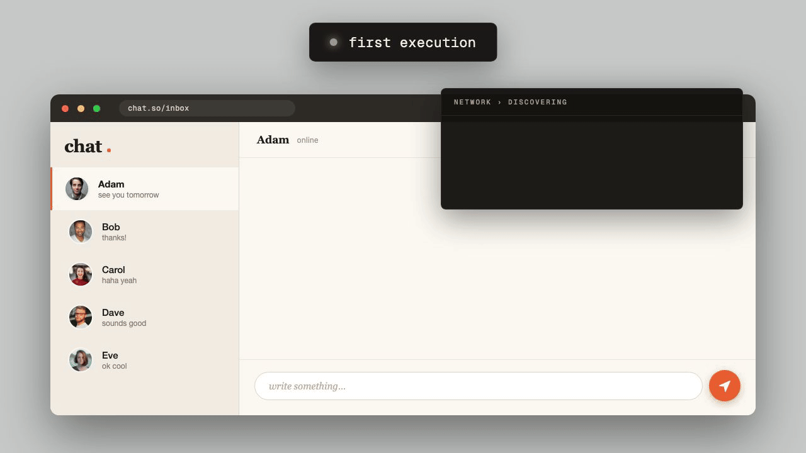
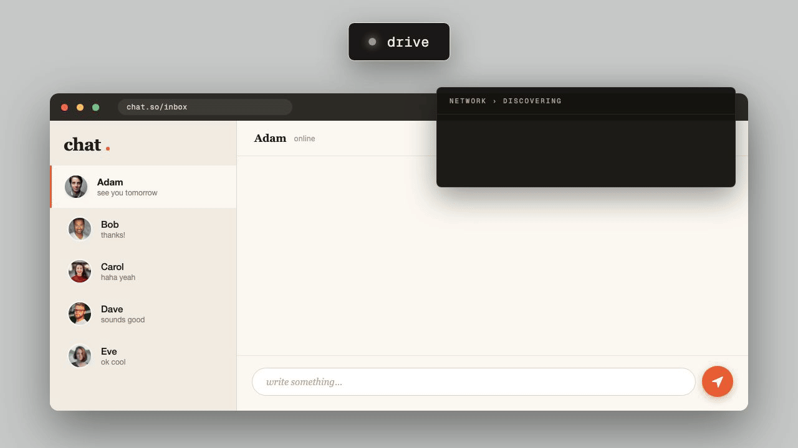
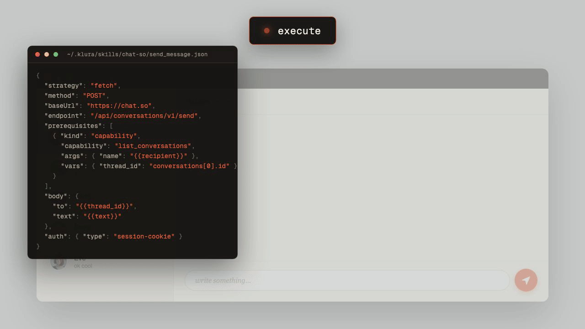
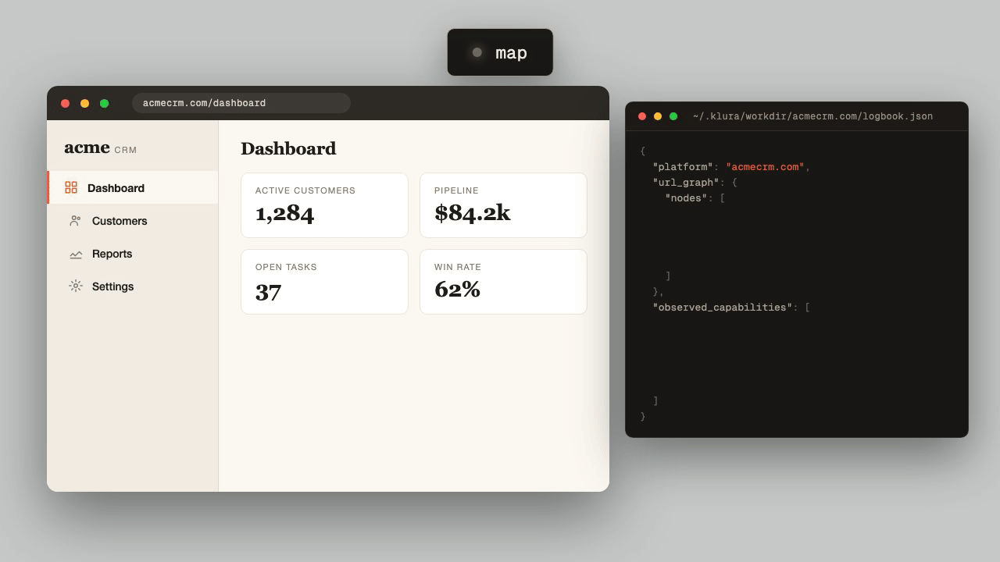

<p align="center">
  <picture>
    <source media="(prefers-color-scheme: dark)" srcset="wordmark-dark-bg.png">
    
  </picture>
</p>

<p align="center"><strong>Your agent learns a website once. Every run after is a direct API call — zero tokens, no browser.</strong></p>

<p align="center"><sub>Klura is an MCP runtime your LLM agent uses to drive a browser, learn the API underneath, and save the result as a reusable skill.</sub></p>

<p align="center">
  <a href="https://www.npmjs.com/package/@klura/runtime"></a>
  <a href="https://www.npmjs.com/package/@klura/runtime"></a>
  <a href="https://nodejs.org/"></a>
  <a href="https://www.typescriptlang.org/"></a>
  <a href="https://modelcontextprotocol.io/"></a>
  <a href="https://discord.gg/YJQ2zZYJ"></a>
  <a href="LICENSE"></a>
  <a href="#contributing"></a>
</p>

---

# Turn any website into an API

Klura lets an agent use the browser once, learn the underlying interface, and turn future runs into direct API calls.

```text
First run:
> message Amanda in the team chat using klura
  opens browser, completes the task, captures traffic

Lift:
> yes, analyze the capture
  learns the real request behind the UI

Later:
> message Bob in the team chat using klura
  direct saved strategy → ~0.3s · 0 tokens
```

Browser agents pay for the UI on every run. Klura pays once.

|  | Hacker News search | GitHub create issue | Messenger send message |
| --- | --: | --: | --: |
| Plain browser agent — every run | 22.9s · 63k tok · $0.05 | 160s · 634k tok · $0.29 | 134s · 435k tok · $1.06 |
| **Klura, warm — no LLM in the loop** | **0.33s · 0 tok · $0** | **1.23s · 0 tok · $0** | **5ms · 0 tok · $0** |

<sub>The first klura run costs a normal browser-agent run plus one-time reverse-engineering — full table and method in <a href="#benchmarks">Benchmarks</a>.</sub>

<p align="center">
  <picture>
    <source media="(prefers-color-scheme: dark)" srcset="hero-dark.gif">
    
  </picture>
</p>

Klura watches what the browser actually does — requests, responses, cookies, page state, tokens, and action trails — then turns repeatable flows into saved executable strategies.

The next time your agent needs the same task, it does not rediscover the page. It calls the saved strategy.

---

<p align="center"><sub>
  <a href="#quick-start">Quick Start</a> &nbsp;·&nbsp;
  <a href="#how-it-works">How It Works</a> &nbsp;·&nbsp;
  <a href="#lift">LIFT</a> &nbsp;·&nbsp;
  <a href="#self-healing">Self-Healing</a> &nbsp;·&nbsp;
  <a href="#map-mode">Map Mode</a> &nbsp;·&nbsp;
  <a href="#benchmarks">Benchmarks</a> &nbsp;·&nbsp;
  <a href="#under-the-hood">Under the Hood</a> &nbsp;·&nbsp;
  <a href="#use-cases">Use Cases</a> &nbsp;·&nbsp;
  <a href="#legal--tos">Legal &amp; ToS</a> &nbsp;·&nbsp;
  <a href="#docs">Docs</a> &nbsp;·&nbsp;
  <a href="#get-involved">Get Involved</a>
</sub></p>

---

## Quick Start

Add klura to your MCP client — Claude Code, Claude Desktop, Cursor, Windsurf, OpenClaw, or any MCP-compatible host.

### Claude Code

The fastest path is the CLI:

```bash
claude mcp add klura -- npx -y @klura/mcp
```

That registers klura at user scope. To install per-project, drop it into `.mcp.json` at the repo root:

```json
{
  "mcpServers": {
    "klura": {
      "command": "npx",
      "args": ["-y", "@klura/mcp"]
    }
  }
}
```

You can also edit `~/.claude.json` directly, but `claude mcp add` is the supported path. After install, run `claude mcp list` to confirm klura is registered.

### Claude Desktop, Cursor, Windsurf, OpenClaw

These hosts share the same MCP config shape. Drop the snippet into the host's MCP config file (e.g. `claude_desktop_config.json` for Claude Desktop) and restart the client:

```json
{
  "mcpServers": {
    "klura": {
      "command": "npx",
      "args": ["-y", "@klura/mcp"]
    }
  }
}
```

### From a local checkout (development)

If you're working on klura itself, link the local build into your global path so MCP hosts and the `klura` CLI both see your changes:

```bash
cd runtime
npm install
npm run build
npm link
```

After every code change, re-run `npm run build` and restart the daemon: `klura restart-runtime --force` (or `pkill -f 'klura.*daemon'`).

### Try it

Now ask your agent to do a website task:

```text
message Adam in the team chat using klura
```

If klura already knows the task, it runs the saved strategy.

If not, your agent opens a browser and completes the task normally while klura records what happens underneath. Afterward, klura can analyze the captured trace and learn the real interface behind the UI.

The next time you ask:

```text
message Bob in the team chat using klura
```

klura can skip the page entirely and execute the saved strategy directly.

---

## How It Works

Browser agents are slow because they keep using the UI as the interface.

Klura treats the UI as a discovery step.

```text
1. First run
   The agent uses the browser normally.

2. Capture
   Klura records traffic, cookies, page state, and action history.

3. Lift
   Klura analyzes the trace and learns the underlying request or script.

4. Later runs
   The saved strategy executes directly.
```

The saved output is not “agent memory.” It is executable strategy data built from the observed session.

---

## LIFT

**LIFT** means **Learn Interface From Traffic**.

It is the analysis pass that turns a captured browser session into a reusable strategy.

```text
Before LIFT:                    After LIFT:
  click button                    POST /api/messages
  wait for UI update              {"text": "hello"}
  read confirmation               ~200ms, 0 LLM tokens
```

<p align="center">
  <picture>
    <source media="(prefers-color-scheme: dark)" srcset="learn-graph-dark.gif">
    
  </picture>
</p>

A saved `fetch` strategy looks like this:

```json
{
  "strategy": "fetch",
  "method": "POST",
  "baseUrl": "https://chat.so",
  "endpoint": "/api/conversations/v1/send",
  "prerequisites": [
    {
      "kind": "capability",
      "capability": "list_conversations",
      "args": {
        "name": "{{recipient}}"
      },
      "vars": {
        "thread_id": "conversations[0].id"
      }
    }
  ],
  "body": {
    "to": "{{thread_id}}",
    "text": "{{text}}"
  },
  "auth": {
    "type": "session-cookie"
  }
}
```

On later runs, klura reads this strategy, resolves prerequisites, fills placeholders from the call arguments, and fires the request directly.

Strategies are saved as ordinary JSON files under:

```text
~/.klura/skills/<platform>/
```

See [REFERENCE.md](REFERENCE.md#fetch-schema) for the full schema and [REFERENCE.md#capability-prereq](REFERENCE.md#capability-prereq) for prerequisite handling.

---

## Strategy Tiers

Klura saves the simplest strategy that actually works.

| Tier | Strategy        | Used when                                                            |
| ---- | --------------- | -------------------------------------------------------------------- |
| T0   | `fetch`         | A direct HTTP or WebSocket call is enough                            |
| T1   | `page-script`   | The page must run JavaScript to build, sign, or dispatch the request |
| T2   | `recorded-path` | The safest available path is replaying the UI                        |

The tier reflects **where the saved code runs**:

- `fetch` is a static templated HTTP call, fired from Node. Possible when every input — body, headers, tokens — can be reconstructed without the page.
- `page-script` runs JavaScript inside the live, already-authenticated browser tab. It can call functions the site itself defines: request signers, header rotators, MQTT codecs, WebSocket encoders, the in-page fetch wrapper. That makes lift possible for sites where the real request only exists as the output of in-page code, with no way to reproduce it from outside.
- `recorded-path` replays UI actions through the browser driver. Slower, but works when the request can't be cleanly isolated.

If a site cannot be lifted cleanly to `fetch` or `page-script`, klura still saves a `recorded-path`.

That is slower than a direct API call, but still avoids replanning the page from scratch. The same skill can later be re-lifted into a faster tier.

---

## Self-Healing

Websites change. Endpoints move. Tokens rotate. Response shapes drift.

Klura treats those as repairable failures.

<p align="center">
  <picture>
    <source media="(prefers-color-scheme: dark)" srcset="execute-relearn-dark.gif">
    
  </picture>
</p>

When a saved strategy fails, klura classifies the failure:

| Failure type          | What happens                                                  |
| --------------------- | ------------------------------------------------------------- |
| Structural            | Klura returns a clear error the agent can act on              |
| Stale strategy        | Klura routes back through capture and LIFT to patch the skill |
| Auth or session issue | Klura asks for the minimum required human help                |

The goal is not silent retries. The goal is loud, structured failure and repair.

---

## Map Mode

You do not need to start with a specific task.

Klura can scout a site first.

```text
map this CRM with klura
```

The agent walks the surface area — pages, forms, settings, search, account flows — while klura records what it sees in a platform logbook.

<p align="center">
  <picture>
    <source media="(prefers-color-scheme: dark)" srcset="map-graph-dark.gif">
    
  </picture>
</p>

The logbook lives under:

```text
~/.klura/workdir/<platform>/
```

It stores things like:

- URL graph nodes
- form observations
- observed capabilities
- page notes
- useful surface-area hints for future sessions

No strategy is saved in map mode. Mutating actions require explicit consent.

The next real task starts with klura already familiar with the platform.

See [docs/logbook.md](docs/logbook.md).

---

## Why Klura Exists

Agents should not have to rediscover the same UI forever.

The UI is not the real interface. It is the human layer over requests, responses, tokens, cookies, state, and event streams.

Klura captures that lower layer and turns it into something reusable.

|               | Browser agent             | Klura                                 |
| ------------- | ------------------------- | ------------------------------------- |
| First run     | Browser exploration       | Browser exploration + network capture |
| Learning step | None                      | Optional LIFT pass                    |
| Later runs    | Browser exploration again | Saved strategy                        |
| Tokens        | Paid every run            | Paid once, then zero in runtime       |
| Latency       | Seconds per UI step       | Usually one request                   |

The agent stays in the loop when judgment is needed. The runtime takes over when the task has become mechanical.

---

## Benchmarks

Same task, same Claude model, same agent loop on both sides — the only difference is whether klura has seen the task before.

|  | Hacker News search | GitHub create issue[^github-re] | Messenger send message[^messenger-re] |
| --- | --: | --: | --: |
| Plain browser agent — paid every run | 22.9s · 63k tok · $0.054 | 160s · 634k tok · $0.29 | 134s · 435k tok · $1.06 |
| **Klura warm — runtime only**[^runtime-only] | **0.33s · 0 tok · $0** | **1.23s · 0 tok · $0** | **5ms · 0 tok · $0** |
| Klura cold — first run only[^cold-includes-lift] | 43.8s · 363k tok · $0.191 | 318s · 1.29M tok · $0.84 | 1469s · 1.78M tok · $1.56 |

**Warm** is the runtime call itself — no LLM in the loop, deterministic replay. This is what every run after the first costs: usually one request.

**Cold** is the one-time tax. The agent first completes the task like any browser agent (roughly the "plain browser agent" row), then reverse-engineers the protocol and saves a runnable strategy. Hard sites cost more here — Messenger's send path is a binary MQTT frame with snowflake IDs and an in-page codec, so cold is ~24 minutes of work that the next thousand sends never pay again.

When klura runs inside an agent SDK, MCP host, or conversational loop, the host may still spend a couple of LLM turns deciding to call the saved skill and reporting the result. The warm row measures the saved-strategy execution itself.

The benchmark harness runs both columns through the same Claude model and the same Agent SDK loop against live public sites — built so the numbers aren't a self-report. Full method and reproducible results are published alongside the runtime.

[^cold-includes-lift]: Klura cold time includes discovery, triage, and LIFT. The agent first completes the user's task, then reverse-engineers the protocol and persists a runnable strategy. The actual sending or searching portion is roughly comparable to the raw Playwright row; the remainder is one-time work that amortizes across future runs.

[^runtime-only]: No agent SDK in the loop. n=5 sequential, median wall-clock. GitHub's number is the median of a clean 5/5-ok page-script. When this same path is dispatched from inside an agent loop, add the host's LLM latency on top.

[^github-re]: GitHub's web flow posts to `/_graphql` with a persisted-query hash, an `X-Fetch-Nonce` header that the in-page bundle rotates, and a numeric repository ID pulled from the rendered page. Sonnet 4.6 identified the call, isolated the rotating signal, and saved a `page-script` with `js-eval` prerequisites that read the nonce and client-version off the live page on each invocation.

[^messenger-re]: Messenger send is an MQTT PUBLISH on `/ls_req`, with a JSON body whose snowflake IDs exceed `Number.MAX_SAFE_INTEGER`, a packet-id counter in the in-page MQTT client, and binary framing through the page's `MqttProtocolCodec`. Sonnet 4.6 located the encoder, intercepted the live connection, decoded the envelope, and saved a script that rebuilds and dispatches the frame through the already-authenticated socket.

---

## Under the Hood

Klura is built around a few constraints:

- Keep the LLM in charge of judgment.
- Keep the runtime boring where possible.
- Never silently accept broken strategies.
- Prefer real observed traffic over guesses.
- Fall back safely when a clean lift is not possible.

### Runtime and Agent

The runtime provides tools, captures data, validates output, executes strategies, and handles recovery.

The agent performs the reasoning: deciding what task is being done, choosing capabilities, composing prerequisites, and resolving ambiguity.

There is no heavy workflow engine. Capability composition happens in the agent turn, where user context already lives.

Example:

```text
message Bob in team chat
```

may compose:

```text
list_conversations(name="Bob")
send_message(thread_id=..., text=...)
```

The runtime executes the saved pieces.

### Audits

Every saved strategy passes a structural audit before it hits disk.

The audit checks for problems like:

- dynamic values baked into static requests
- missing arguments
- missing auth assumptions
- weak or non-generalized selectors
- response-shape mismatches
- unsafe endpoint behavior

Issues are batched into one rejection so the agent can fix everything in one retry.

### Sessions Persist

Browser sessions persist between runs.

Cookies, login state, and storage stay warm because the daemon outlives any single conversation. A site that asks for 2FA once a week should not require login every time an agent starts a new task.

### Token Refresh

Klura tracks estimated token lifetimes and refreshes before expiry when possible.

The goal is to avoid the common failure mode where long-running automation fails only after a CSRF token, nonce, or session value has already expired.

### Network Stack Selection

Some sites work over plain Node `fetch`.

Others reject anything that does not look like the real browser stack.

Klura picks the execution path per request and can fall back to an in-browser path when needed.

### Streams

Klura supports listener-style capabilities for push streams:

- WebSocket
- Server-Sent Events
- polling feeds

Saved skills like `on_new_message` are first-class.

### Human Handoff

Some interruptions need a human:

- CAPTCHA
- 2FA
- “confirm this is you”
- password prompts
- account recovery walls

Klura opens a live viewer of the in-progress browser session. You solve the blocker, and the agent continues from the same state.

Password handling resolves in this order:

1. remote viewer
2. user-supplied shell command
3. ask-in-chat as a last resort

See [docs/remote.md](docs/remote.md) and [docs/interruptions.md](docs/interruptions.md).

---

## Reverse Engineering Toolkit

Most sites are simple. Some are not.

For signed requests, binary protocols, minified encoders, rotating IDs, and hidden request builders, klura exposes deeper tools to the agent.

Examples:

- find the request builder in bundled JavaScript
- set breakpoints when a request fires
- inspect signing functions from the live page
- locate WebSocket encoders
- compare binary payloads by structure instead of exact bytes
- classify failed probes as getting closer, stuck, or oscillating

The runtime does not brute-force endpoints, enumerate IDs outside the user's scope, or fuzz inputs.

See [docs/reverse-engineering.md](docs/reverse-engineering.md).

---

## Use Cases

Klura is useful when the task is repetitive, browser-based, and not well-served by a public API.

Good fits:

- internal tools
- legacy admin panels
- SaaS products behind login
- web apps with private APIs but no public API
- repeated form submissions
- customer support workflows
- message sending
- issue creation
- CRM updates
- dashboard reads
- workflows that currently require brittle Playwright scripts

Bad fits:

- one-off tasks
- sites you are not authorized to use
- high-scale scraping
- endpoint or ID enumeration
- tasks that violate platform policy
- flows where the UI is intentionally the security boundary

### What klura isn't

- **A scraping framework.** Klura targets your own logged-in sessions, not unauthenticated pages at scale. If you're comparing it to Botasaurus, undetected-chromedriver, playwright-stealth, or Apify, that's a different category of tool.
- **Code you write.** Strategies are reverse-engineered from one observed browser run by the LLM driving the session. There's no Python or JS script for you to author or maintain.
- **An anti-detect toolkit.** Stealth fingerprint patches are supported; behavioral evasion (humanlike cursor jitter, residential proxies, CAPTCHA-solving services) isn't part of the mainline.

---

## Model Variance and Reliability

Klura depends on the model driving it.

Models extract capabilities differently. Some follow instructions tightly. Some improvise. Some handle signed or encoded flows well. Others struggle.

Current snapshot:

| Model | Status |
| --- | --- |
| Sonnet 4.6 and newer | Strongest tested overall; often one-shots complex LIFTs and reverse-engineering flows |
| GLM 4.7 | Solid across most ordinary tasks |
| GPT models | Not yet extensively tested |

Expect variability during discovery.

Saved strategies replay deterministically. Variance lives mostly in the learning phase.

Useful reliability metrics we track or intend to track:

- LIFT success rate
- percentage of skills saved as `fetch`
- percentage saved as `page-script`
- percentage stuck at `recorded-path`
- time-to-warm-execution
- relearn frequency
- stale-strategy repair success rate

---

## Legal & ToS

Klura drives a real browser session you are already logged into and replays the same kinds of calls your own UI makes on your own account.

That is generally on the authorized side of unauthorized-access law.

Platform Terms of Service are separate.

Many major platforms restrict automation. Whether your usage triggers enforcement depends on the platform and how you use klura.

Practical guidance:

- read the policy of any site you automate
- stay within your own account and authorization scope
- avoid doing at scale what you would not reasonably do manually
- do not enumerate endpoints
- do not enumerate IDs outside your own scope
- do not fuzz inputs
- use klura's policy tools to cap strategy tiers per platform

See [docs/policy.md](docs/policy.md), [docs/trust.md](docs/trust.md), and [docs/principles.md#stealth-not-bot-evasion](docs/principles.md#stealth-not-bot-evasion).

---

## Configuration

Runtime settings live in:

```text
~/.klura/config.json
```

You can edit the file directly or ask your agent to use klura's configuration tools:

- `describe_config`
- `configure`
- `restart_runtime`

A few knobs that are worth knowing about up front:

- `pool.driver` (default unset → bundled Playwright driver) — switches the browser driver. Set to `"@klura/driver-playwright-stealth"` to enable stealth fingerprint patches (puppeteer-extra-plugin-stealth) for sites with stricter bot detection. BYO drivers can be installed by package name or absolute path.
- `remote.auto_open` (`"always" | "on_local" | "never"`, default `"on_local"`) — when the remote viewer URL is reachable from the runtime host, klura spawns the OS URL handler so your default browser opens the viewer automatically. Skips the LLM-relay channel where long signed URLs tend to get a single byte garbled. Set to `"never"` for headless / SSH setups.
- `remote.short_url` (boolean, default `true`) — surface a short single-use redirect URL (≈16 chars, 60s TTL) to the agent instead of the full JWT URL. Survives chat-renderer rewrites where the long URL doesn't.

See [docs/run-lifecycle.md#settings-reference-kluraconfigjson](docs/run-lifecycle.md#settings-reference-kluraconfigjson) and [REFERENCE.md#configure](REFERENCE.md#configure).

---

## Docs

Start here:

- [ARCHITECTURE.md](ARCHITECTURE.md) — lifecycle, strategy tiers, secondary capabilities, and docs map
- [REFERENCE.md](REFERENCE.md) — strategy schemas and agent-facing reference
- [docs/discovery.md](docs/discovery.md) — how discovery works and what gets saved
- [docs/reverse-engineering.md](docs/reverse-engineering.md) — deeper toolkit for signed, encoded, and binary requests
- [docs/logbook.md](docs/logbook.md) — platform maps and persistent observations
- [docs/run-lifecycle.md](docs/run-lifecycle.md) — daemon lifecycle and runtime settings
- [docs/principles.md](docs/principles.md) — design principles behind the runtime
- [docs/policy.md](docs/policy.md) — policy controls and safety boundaries
- [docs/trust.md](docs/trust.md) — trust model and operational guidance
- [docs/remote.md](docs/remote.md) — live viewer and human handoff
- [docs/interruptions.md](docs/interruptions.md) — CAPTCHA, 2FA, passwords, and blockers

---

## Get Involved

Klura is new and moving fast. If the idea resonates:

- ⭐ **Star the repo** to follow along.
- 💬 **Join the [Discord](https://discord.gg/YJQ2zZYJ)** — discovery walkthroughs, what's breaking, what's next.
- 🐛 **Open an issue** naming a site you wish your agent could just _use_. Real workflows drive what gets built.
- 🔧 **Contribute** a driver, transport, prerequisite method, or benchmark site — see [Contributing](#contributing).

The single most useful thing you can do: point klura at the most annoying internal tool you have, watch run 1 versus run 2, and tell us what broke.

---

## Built By

[Narek Mailian](mailto:hello@klura.ai) — freelance engineer.

Klura is a standalone project.

Commercial licensing, strategic partnerships, or integration conversations:

[hello@klura.ai](mailto:hello@klura.ai)

---

## Contributing

Before opening a PR, skim [docs/principles.md](docs/principles.md).

Contributions that fit especially well:

- drivers
- pool backends
- listener transports
- prerequisite methods
- validation improvements
- benchmark sites
- focused test fixtures
- better docs for real workflows

Please avoid:

- endpoint probing
- ID enumeration outside the user's own scope
- mainline bot-evasion features
- platform-specific runtime heuristics
- brand names in agent-facing docs

Contributors sign the **klura Individual Contributor License Agreement** before a PR can be merged.

Full text: [CLA.md](CLA.md).

---

## License

Business Source License 1.1 with an Additional Use Grant.

The Licensed Work converts to the Apache License, Version 2.0 on the Change Date specified in [LICENSE](LICENSE).

See [LICENSE](LICENSE) and [NOTICE](NOTICE) for the full terms.

You may copy, modify, and use the Licensed Work freely for non-production use.

Production use is permitted under the Additional Use Grant, except that you may **not**:

- offer the Licensed Work, in whole or in part, to third parties as a hosted or managed service;
- expose the Licensed Work's functionality to third parties via an API, SDK, or other interface;
- use the Licensed Work to build, offer, or operate a Competing Service; or
- sublicense, sell, or resell access to the Licensed Work or its functionality.

For a commercial license that lifts these restrictions, contact:

[hello@klura.ai](mailto:hello@klura.ai)
